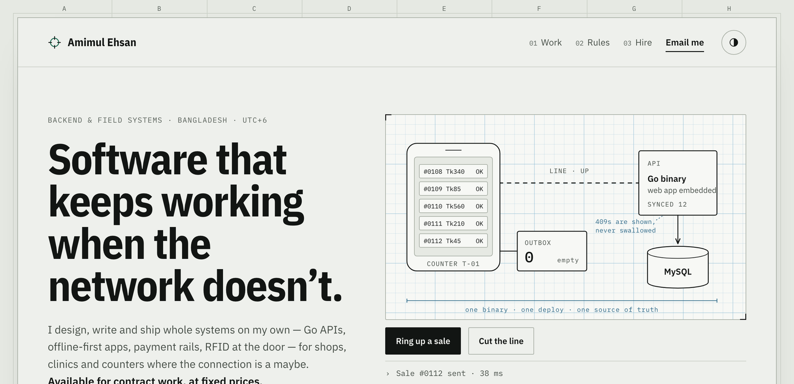

<a href="https://amimul1234.github.io/">
  <picture>
    <source media="(prefers-color-scheme: dark)" srcset="assets/hero-dark.png">
    
  </picture>
</a>

### Backend & field systems engineer · Bangladesh · UTC+6

I design, write and ship whole systems on my own — Go APIs, offline-first apps, payment rails, RFID at the door — for shops, clinics and counters where the connection is a maybe. **Available for contract work, at fixed prices.**

**[Portfolio →](https://amimul1234.github.io/)** &nbsp;·&nbsp; **[Prices →](https://amimul1234.github.io/#hire)** &nbsp;·&nbsp; **[amimulahsan7@gmail.com](mailto:amimulahsan7@gmail.com)**

 

#### Record of work

| System | What it is | Status |
|:--|:--|:--|
| **NEXA / Easy Print** | Pay-per-print kiosk. Scan a QR on the machine, pay with bKash, a print agent releases the job. One Go binary serves the API and the web app. | `LIVE · real payments` |
| **Akhra** | Multi-gym access and billing. RFID tap, the door decides. A database per gym; no query names a tenant. | `DEMO LIVE` — [open](https://akhra.147.93.168.43.sslip.io/) |
| **Nirog** | Hospital management for 20–150 bed hospitals. Postgres row-level security; tests crawl 962 screens across 12 roles. | `DEMO LIVE` — [open](https://nirog.147.93.168.43.sslip.io/) |
| **Tirish** | Credit book for poultry dealers. Offline outbox where a refused write fails loudly; state derived, never stored twice. | `BUILT · e2e green` |
| **MediHisab** | Pharmacy accounting in Bengali. Flutter app on a Go API. | `API LIVE · Play closed test` |
| **Lobb** | Offline phone-to-phone file transfer. Raw-TCP Kotlin engine, 178 MB/s on loopback, every byte verified. | `ENGINE VERIFIED` |

Full write-ups, architecture drawings and the rest are on **[the portfolio](https://amimul1234.github.io/#work)**. Client code stays private.

#### Working with me

| Audit · 3 days | Build sprint · 2 weeks | Retained · monthly |
|:--|:--|:--|
| **$500** — what will break, in order, with the top three fixes applied | **$3,600** — one working system shipped to your production, with tests and a handover doc | **$4,500/mo** — about 100 hours on your backlog, overlapping EU hours and US mornings |

`Go` `Flutter` `Vue` `Kotlin` `PostgreSQL` `MySQL` `AWS` `bKash` — CSE, BUET
