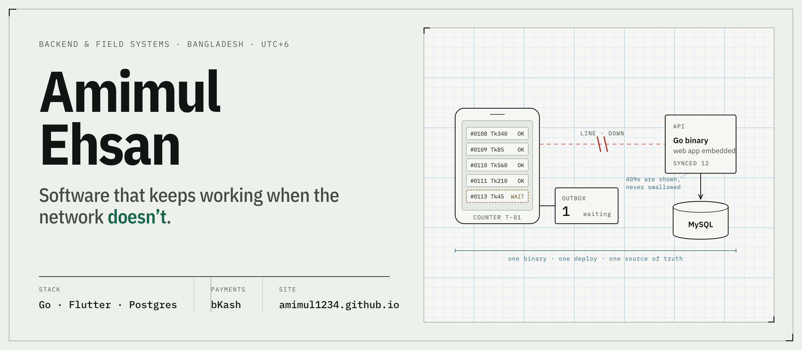
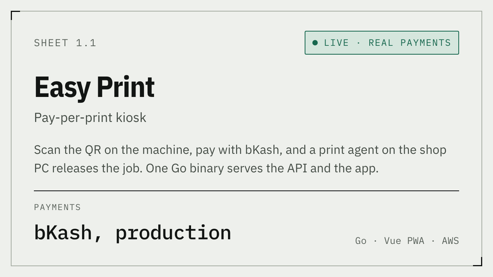
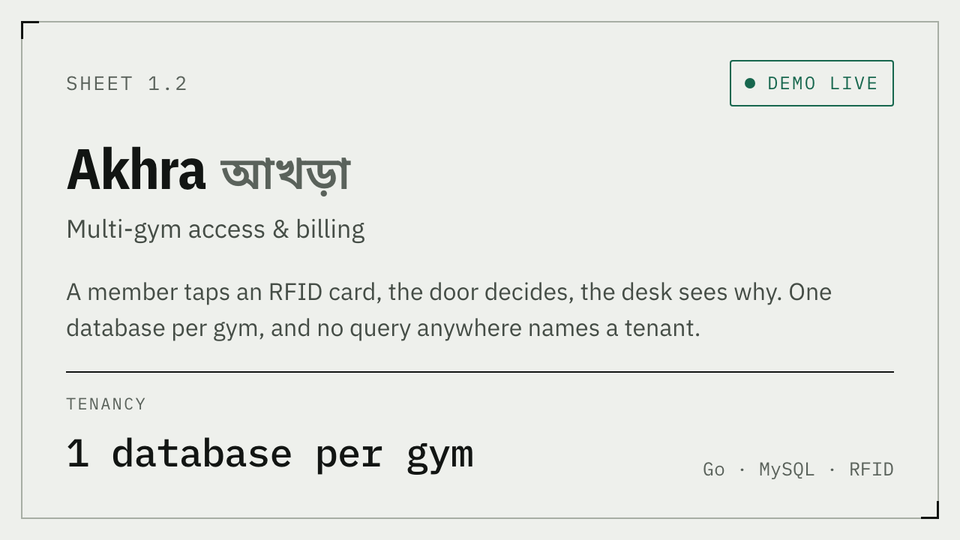
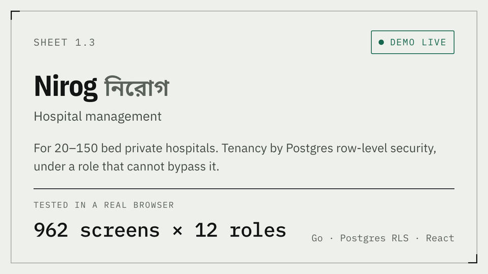
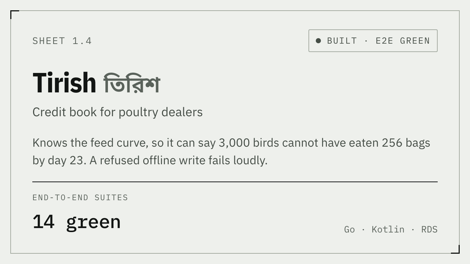
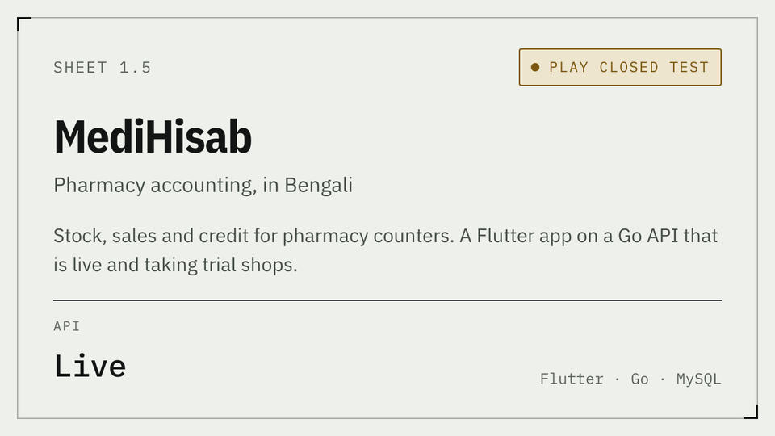
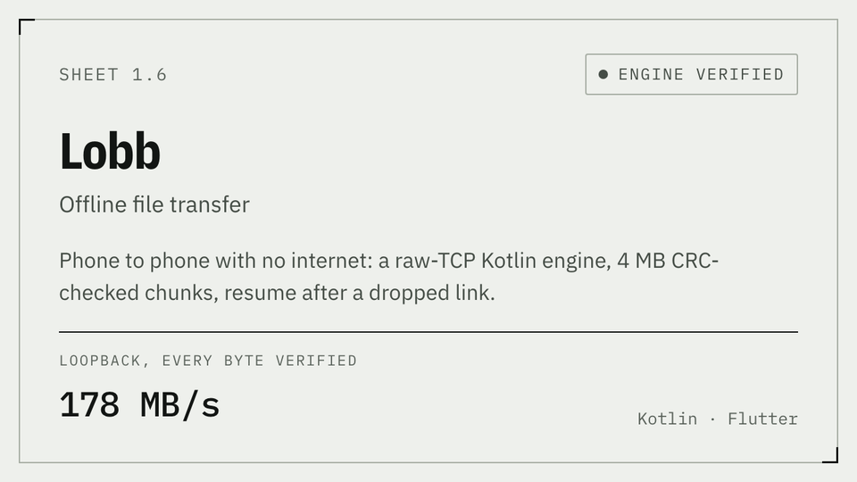

<a href="https://amimul1234.github.io/">
  <picture>
    <source media="(prefers-color-scheme: dark)" srcset="assets/banner-dark.png">
    
  </picture>
</a>

I design, write and ship whole systems on my own — Go APIs, offline-first Flutter apps, bKash payments, RFID at the door — for shops, clinics and kiosks where the connection is a maybe. Client code stays private; below is the record, with honest status.

  <a href="https://amimul1234.github.io/#work"><picture><source media="(prefers-color-scheme: dark)" srcset="assets/card-nexa-dark.png"></picture></a>
  <a href="https://akhra.147.93.168.43.sslip.io/"><picture><source media="(prefers-color-scheme: dark)" srcset="assets/card-akhra-dark.png"></picture></a>

  <a href="https://nirog.147.93.168.43.sslip.io/"><picture><source media="(prefers-color-scheme: dark)" srcset="assets/card-nirog-dark.png"></picture></a>
  <a href="https://amimul1234.github.io/#work"><picture><source media="(prefers-color-scheme: dark)" srcset="assets/card-tirish-dark.png"></picture></a>

  <a href="https://amimul1234.github.io/#work"><picture><source media="(prefers-color-scheme: dark)" srcset="assets/card-medihisab-dark.png"></picture></a>
  <a href="https://amimul1234.github.io/#work"><picture><source media="(prefers-color-scheme: dark)" srcset="assets/card-lobb-dark.png"></picture></a>

Contract work at fixed prices — a three-day audit, a two-week build sprint, or a monthly retainer. [Scope and prices →](https://amimul1234.github.io/#hire)

[amimul1234.github.io](https://amimul1234.github.io/) &nbsp;·&nbsp; [amimulahsan7@gmail.com](mailto:amimulahsan7@gmail.com) &nbsp;·&nbsp; UTC+6
