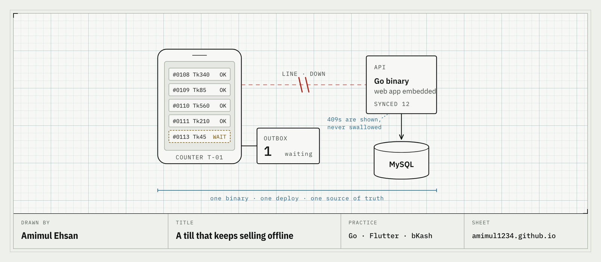

<a href="https://amimul1234.github.io/">
  <picture>
    <source media="(prefers-color-scheme: dark)" srcset="assets/sync-dark.png">
    
  </picture>
</a>

I design, write and ship whole systems on my own: Go APIs, offline-first Flutter apps, bKash payments, RFID at the door. They are built for shops, clinics and kiosks in Bangladesh where the connection is a maybe. Client code stays private; this is the record, with honest status.

| System | What it is | Status |
|:--|:--|:--|
| **NEXA / Easy Print** | Pay-per-print kiosk. Scan a QR on the machine, pay with bKash, a print agent releases the job. One Go binary serves the API and the web app. | `LIVE · real payments` |
| **Akhra** | Multi-gym access and billing. RFID tap, the door decides. A database per gym; no query names a tenant. | `DEMO LIVE` · [open](https://akhra.147.93.168.43.sslip.io/) |
| **Nirog** | Hospital management for 20–150 bed hospitals. Postgres row-level security; tests crawl 962 screens across 12 roles. | `DEMO LIVE` · [open](https://nirog.147.93.168.43.sslip.io/) |
| **Tirish** | Credit book for poultry dealers. Offline outbox where a refused write fails loudly; state derived, never stored twice. | `BUILT · e2e green` |
| **MediHisab** | Pharmacy accounting in Bengali. Flutter app on a Go API. | `API LIVE · Play closed test` |
| **Lobb** | Offline phone-to-phone file transfer. Raw-TCP Kotlin engine, 178 MB/s on loopback, every byte verified. | `ENGINE VERIFIED` |

I take contract work at fixed prices: a three-day audit ($500), a two-week build sprint ($3,600) or a monthly retainer ($4,500). [What each includes →](https://amimul1234.github.io/#hire)

[amimul1234.github.io](https://amimul1234.github.io/) · [amimulahsan7@gmail.com](mailto:amimulahsan7@gmail.com)
